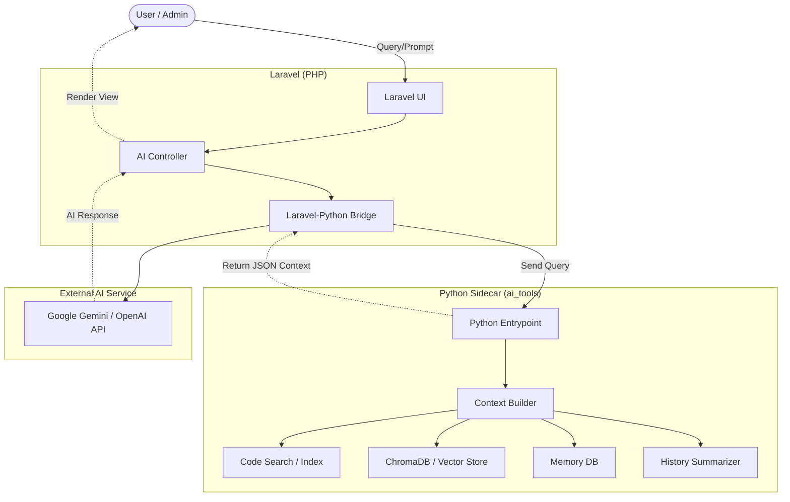

# Antigravity AI Integration Plan

> **Project:** minurulhuda3
> **Goal:** Design the smallest, most efficient integration between the Laravel monolith and the Python AI Sidecar (`ai_tools`).

## 1. Architecture Diagram

---

## 2. Request Flow

1. **User Input:** Admin mengirim pesan/pertanyaan di antarmuka web (Laravel).
2. **Context Request:** Laravel meneruskan pertanyaan tersebut ke `ai_tools` melalui *bridge*.
3. **Context Assembly (Python):** 
   - Python memanggil `ContextBuilder`.
   - Mencari snippet kode yang relevan (Code Search).
   - Mencari dokumen markdown yang relevan (RAG).
   - Mengompres riwayat jika terlalu panjang (History Compression).
4. **Context Return:** Python mengembalikan sekumpulan *string* konteks yang sudah sangat dioptimalkan ke Laravel dalam format JSON.
5. **LLM Generation:** Laravel menggabungkan pertanyaan asli pengguna dengan konteks dari Python, lalu mengirimkannya ke API LLM (misal: Google Gemini).
6. **Response:** LLM memberikan jawaban, Laravel menyimpannya ke database dan menampilkannya ke UI.

---

## 3. Service Responsibilities

**Laravel (The Orchestrator):**
- Menangani *authentication* & *authorization* (RBAC).
- Menangani UI/UX (Blade views).
- Menjadi klien langsung untuk API pihak ketiga (Gemini/OpenAI).
- Menyimpan histori pesan murni (opsional, jika ingin ditampilkan di UI).

**Python Sidecar (The Brain):**
- Tidak berurusan dengan UI.
- Murni menangani komputasi berat: *Vector embedding*, *Token counting*, *Regex Parsing*, dan pencarian algoritme secara cepat.

---

## 4. Integration Options (Ranked by Complexity)

### Option A: Command Line / Symfony Process (Lowest Complexity)
Laravel menggunakan fungsi bawaan `Symfony\Component\Process\Process` untuk menjalankan *script* Python secara lokal.
- **Contoh:** `python get_context.py --query "simpan siswa"`
- **Pros:** Sangat mudah diimplementasikan. Tidak perlu menjalankan *background server* tambahan.
- **Cons:** **Sangat Lambat (Bottleneck).** Setiap kali *script* dijalankan, Python harus meload *Library* berat (seperti `sentence-transformers` dan `chromadb`) ke RAM. Ini akan menambah *delay* 1-3 detik pada setiap *request*.

### Option B: Local REST API / FastAPI (Medium Complexity)
Membungkus `ai_tools` menggunakan `FastAPI` atau `Flask`. Laravel berkomunikasi menggunakan `Illuminate\Support\Facades\Http`.
- **Contoh:** `Http::post('http://127.0.0.1:8000/context', ['query' => 'simpan siswa'])`
- **Pros:** **Sangat Cepat.** Model Machine Learning (embeddings) sudah diam di RAM (*resident memory*). Respon hanya butuh hitungan milidetik.
- **Cons:** Anda harus memastikan server Python berjalan di *background* (bisa menggunakan *tmux*, *screen*, atau *Supervisor*).

### Option C: Message Broker / Redis Queue (Highest Complexity)
Menggunakan *job queue* (Redis) di mana Laravel melakukan *dispatch job* dan *worker* Python mendengarkannya.
- **Pros:** Sepenuhnya asinkronus, tangguh jika LLM mati (*retry-able*).
- **Cons:** Konfigurasi sangat rumit. Berlebihan (*overkill*) untuk proyek berskala kecil menengah.

---

## 5. Recommended Option (for School Project)

**Rekomendasi Utama: Option B (Local REST API dengan FastAPI)**

**Alasan:**
1. **Kecepatan adalah segalanya dalam AI Assistant.** *Delay* tambahan akibat proses memuat *machine learning weights* di CLI (Option A) akan merusak *user experience* dan memberi kesan AI lambat.
2. **Setup Sangat Sederhana:** Menjalankan FastAPI hanya butuh 1 file berukuran < 50 baris kode (`main.py`) dan bisa di-*start* dengan perintah `uvicorn main:app`.
3. **Cocok untuk Skripsi/Tugas Akhir:** Menunjukkan arsitektur *microservice* sederhana (PHP <-> Python API) akan memberikan nilai tambah yang besar (lebih terlihat profesional) dibandingkan sekadar memanggil *script* CLI biasa.

**Rencana Implementasi Terkecil:**
1. Buat `ai_tools/api.py` dengan FastAPI yang memiliki 1 endpoint (`POST /build-context`).
2. Buat Class `AiBridgeService.php` di Laravel yang menggunakan HTTP Client Laravel untuk menembak endpoint tersebut.
3. Hubungkan *service* ini di dalam *controller* chat Anda.
